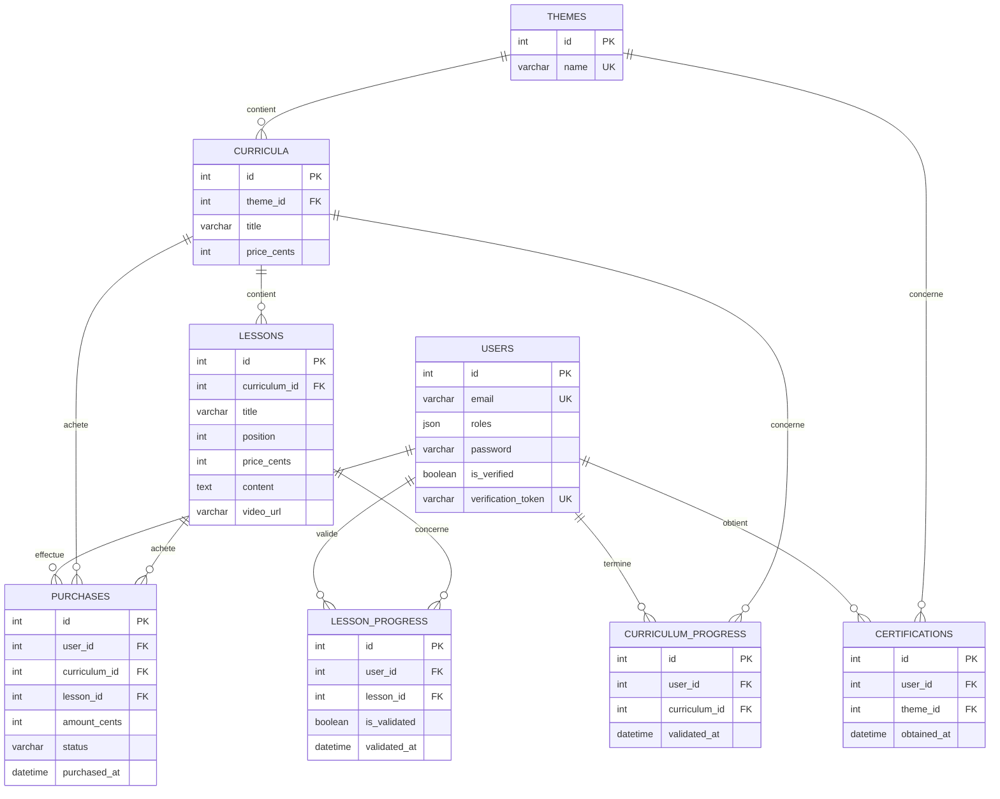

# Modèle physique de données

Toutes les tables métier incluent également `created_at`, `updated_at`, `created_by` et `updated_by`. Les prix sont stockés en centimes pour éviter les erreurs d’arrondi. Les contraintes d’unicité empêchent un doublon de progression ou de certification pour un même utilisateur.
